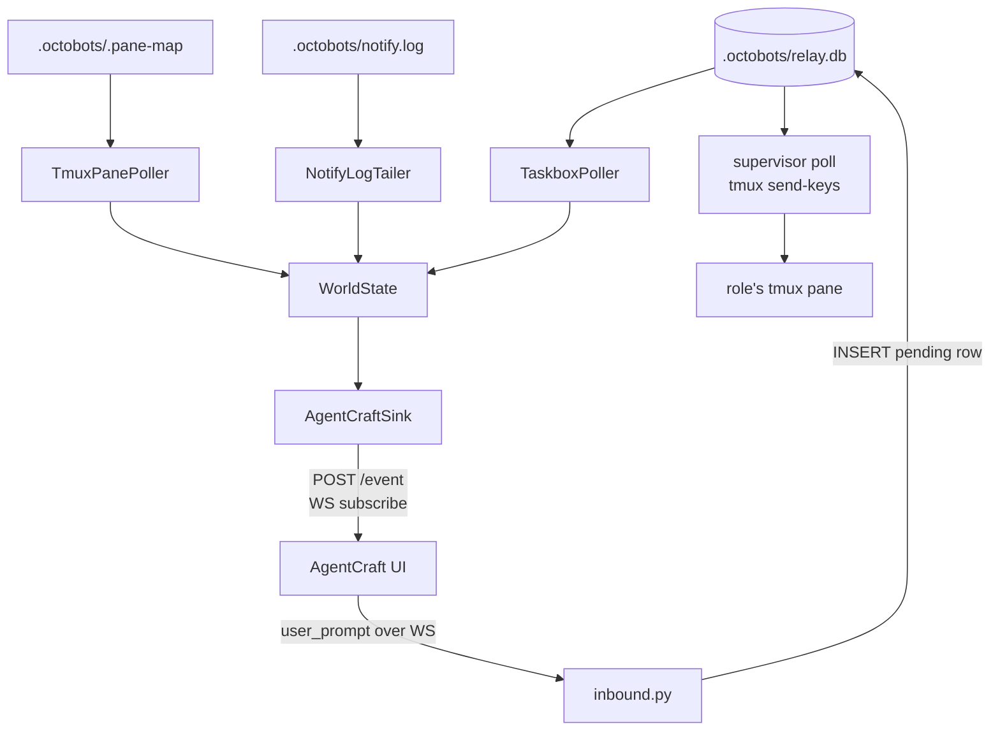

# AgentCraft Bridge

Stream supervisor activity (roles, taskbox messages, notify calls) into
[`@idosal/agentcraft`](https://www.npmjs.com/package/@idosal/agentcraft) — the
RTS-style agent UI — and route prompts typed in AgentCraft back into the
supervisor via the taskbox.

The bridge is the supervisor's monitor process. AgentCraft is treated like
Telegram: an external interface the bridge talks to. We don't bundle, vendor,
or fork AgentCraft — users install it themselves with `npx`.

## Prerequisites

- **Node.js** ≥ 18 (for `npx @idosal/agentcraft`).
- **Python deps** already in `requirements.txt`: `websockets` (used to talk to
  AgentCraft's WS) and `aiohttp` (used by the e2e test only). No new runtime
  deps were added.
- A target project with the supervisor active (i.e. `.octobots/relay.db` and
  `.octobots/.pane-map` are being written).

## Tested against

`@idosal/agentcraft@0.4.1`. The wire protocol is **private and undocumented** —
the translation table in `agentcraft/translate.py` was reverse-engineered from
the published bundle. A version bump can rename event types without notice; if
the UI suddenly stops rendering, that's the first place to look.

## Connect it

Three shells, in order:

```bash
# 1. Start AgentCraft with telemetry endpoints clobbered.
#    Opens AgentCraft in your default browser at http://localhost:2468.
supervisor/monitor/bridge/agentcraft/launch.sh
```

```bash
# 2. In your target project, start the supervisor as usual.
cd /path/to/your/project
python3 octobots/scripts/supervisor.py
```

```bash
# 3. In a third shell, from your target project, start the bridge.
#    It tails relay.db / tmux panes / notify.log and forwards to AC.
cd /path/to/your/project
python3 -m monitor.bridge
```

The bridge boots into a probe loop until AgentCraft is reachable, then logs:

```
agentcraft analytics disabled in /Users/<you>/.agentcraft/settings.json
agentcraft sink configured: url=http://localhost:2468 team=<project> ...
agentcraft reachable at http://localhost:2468
agentcraft analytics confirmed off
agentcraft replay: N agents
agentcraft ws connected: ws://localhost:2468
```

## Verify it works

In the AgentCraft browser UI you should see, in order:

1. A **team** named after your project directory.
2. One **hero** per supervisor role. Their `agentType` is the role id (e.g.
   `python-dev`, `pm`).
3. **Activity flicker** as roles type in their tmux panes — `idle` ↔ `typing`.
4. **Notice-board entries** when a role posts a taskbox message
   (`MessageSentEvent` → `notice_board_message`). When the recipient acks,
   the notice resolves.
5. **Notifications** when a role calls the user via the `notify` MCP tool.

For inbound: type a prompt at one of the heroes in AgentCraft. The bridge
logs:

```
inbound prompt -> taskbox: id=<msgid> recipient=<role> len=<n>
```

and a row appears in `.octobots/relay.db`:

```bash
sqlite3 .octobots/relay.db \
  "SELECT sender, recipient, content, status FROM messages \
   WHERE sender='user@agentcraft' ORDER BY created_at DESC LIMIT 1;"
```

The supervisor's main-loop poll (default 15 s) sees the new row and
dispatches it to the role's tmux pane via `send-keys` — same code path
as any other taskbox message.

## Configuration (env vars)

All optional; reasonable defaults.

| Variable | Default | Purpose |
|---|---|---|
| `OCTOBOTS_AGENTCRAFT_URL` | `http://localhost:2468` | AC server endpoint. |
| `OCTOBOTS_AGENTCRAFT_TEAM_NAME` | project dir name | Override the team label shown in the UI. |
| `OCTOBOTS_AGENTCRAFT_SETTINGS` | `~/.agentcraft/settings.json` | Where the bridge writes `analyticsEnabled:false`. |
| `OCTOBOTS_AGENTCRAFT_HTTP_TIMEOUT` | `5.0` | HTTP timeout (s). |
| `OCTOBOTS_AGENTCRAFT_QUEUE_SIZE` | `1024` | Outbound queue depth. New events are dropped (oldest-first) when full. |
| `OCTOBOTS_AGENTCRAFT_PROBE_INTERVAL` | `5.0` | Health-probe cadence (s) while AC is unreachable. |

Producer-side knobs (paths, poll intervals) live in `monitor/bridge/config.py`
and use the existing `OCTOBOTS_*` env vars (e.g. `OCTOBOTS_RELAY_DB`).

## Telemetry — what's actually off

`@idosal/agentcraft@0.4.x` ships with a **live PostHog API key** and **live
Supabase URL** baked into `server/dist/build-env.json`. We disable telemetry
two ways:

1. **`launch.sh`** sets `POSTHOG_API_KEY=disabled-by-octobots`,
   `POSTHOG_HOST=http://127.0.0.1:1`, `SUPABASE_URL=http://127.0.0.1:1`,
   `SUPABASE_ANON_KEY=disabled-by-octobots`. Non-empty values short-circuit
   the build-env fallback (`process.env.X || build_env.X`); bogus loopback
   hosts mean any latent client init can't reach a real server.
2. **`enforce.ensure_analytics_disabled()`** writes
   `analyticsEnabled: false` to `~/.agentcraft/settings.json` (preserving any
   other keys you've set). This gates `capture()` calls inside the AC server
   even when `launch.sh` isn't used.

The bridge probes `GET /settings` on first connect; if AC reports
`analyticsEnabled` is anything other than `false`, you'll see:

```
AGENTCRAFT TELEMETRY MAY BE ON: server reports analyticsEnabled=...
```

In that case AC was started before the bridge wrote the settings file —
restart AC.

## Architecture



Module map:

```
monitor/bridge/
├── __main__.py        # entry: wire sources to sink, run forever
├── config.py          # producer-side knobs (paths, poll intervals)
├── events.py          # internal dataclasses (sources -> sink)
├── state.py           # WorldState (agents + recent messages)
├── sources/
│   ├── taskbox.py     # tails relay.db, emits Message* events
│   ├── tmux_panes.py  # captures pane content, emits AgentSpawn/State events
│   └── notify_log.py  # tails notify.log, emits Notify events
└── agentcraft/
    ├── translate.py   # pure: event -> [(method, path, body)]
    ├── client.py      # HTTP queue + WS reconnect
    ├── sink.py        # lifecycle + handle(event)
    ├── inbound.py     # WS user_prompt -> relay.db insert
    ├── enforce.py     # ~/.agentcraft/settings.json writer
    ├── launch.sh      # AC launcher with telemetry env clobbered
    └── config.py      # AC-specific env vars
```

## Wire protocol summary

Outbound (bridge → AC):

| Supervisor event | Endpoint / `type` field |
|---|---|
| `AgentSpawnEvent` | `POST /event` × 2: `team_member_detected`, `agent_start` <br> + `POST /settings/hero/<id>` (customName, title, colorIndex) |
| `AgentDespawnEvent` | `POST /event` `agent_complete` |
| `AgentStateEvent(idle/typing/sending/blocked)` | `POST /event` `hero_activity_update` |
| `AgentStateEvent(awaiting_reply)` | `POST /event` `awaiting_input` |
| `AgentStateEvent(calling_user)` | `POST /event` `awaiting_input` + `notification` |
| `MessageSentEvent` (role → role) | `POST /event` `notice_board_message` (`status:"pending"`) |
| `MessageSentEvent` (role → `"user"`) | `POST /event` × 3: `notification` + `awaiting_input` (sender hero) + `notice_board_message` |
| `MessageClaimedEvent` | `POST /event` `notice_board_message` (same `noticeId`, `status:"processing"`) |
| `MessageDoneEvent` | `POST /event` `notice_resolved` |
| `NotifyEvent` | `POST /event` `notification` |

### Plan approval / asking the user (PM → user)

Most approvals in octobots are role-to-role and ride the existing taskbox
ack flow — no special bridge handling. The exception is when a role
(typically PM) needs the *user's* yes/no on a plan.

**Convention**: send a taskbox message with `recipient = "user"`. The
bridge recognizes this magic recipient and surfaces the message
differently:

```bash
# PM-side
relay.py send --from pm --to user "Plan: ship release v2.3. Approve? (yes/no)"
```

The bridge translates the resulting `MessageSentEvent` into three AC
calls instead of one:

1. `notification` for `sessionId=pm` — pings the user.
2. `awaiting_input` for `sessionId=pm` — PM's hero shows as paused.
3. `notice_board_message` — keeps the plan visible in chat history.

**User reply**: the user types a free-text response into PM's hero chat
in AC. That arrives as `user_prompt` over WS and lands in `relay.db`
as a normal taskbox message (`sender="user@agentcraft", recipient="pm"`).
The supervisor's poll dispatches it to PM's pane within ~15 s; PM
parses approval and is responsible for matching the reply to the
outstanding request — FIFO is fine since `plan-feature/SKILL.md`
already enforces one-at-a-time.

**Closing the loop**: PM acks the original `recipient="user"` message
once it has parsed the reply. That fires `MessageDoneEvent` →
`notice_resolved`, removing the notice in AC.

Inter-role approvals (e.g. dev → tech-lead for code review) need no
bridge changes — they're regular taskbox messages with regular acks.

### Hero customization

On every spawn (and on initial snapshot replay), the bridge POSTs to
`/settings/hero/<sessionId>` with at most three fields:

- `customName` — pulled from `theme.short_name`, falling back to the
  first `aliases:` entry, truncated to 50 chars.
- `title` — the role name (the `name:` field from AGENT.md), truncated
  to 50 chars.
- `colorIndex` — derived from the top-level `color:` word in
  AGENT.md frontmatter (`red→0`, `orange→1`, `yellow→2`, `green→3`,
  `blue→4`, `purple→5`, `magenta/pink→6`, `cyan→7`, `brown→8`,
  `gray/grey/white/black→9`). Unknown words are skipped (no `colorIndex`
  sent).

If a role has neither theme nor alias, only `title` is sent so the hero
at least shows the role id rather than a generic placeholder.

Inbound (AC → bridge, over WS):

| AC frame | Bridge action |
|---|---|
| `{type:"user_prompt", sessionId, prompt}` | Insert pending row into `relay.db` (sender = `user@agentcraft`). |
| `{type:"permission_response", ...}` | Logged, dropped. (No supervisor-side gate yet.) |
| anything else | Ignored. |

## Troubleshooting

**Bridge stays in `waiting for agentcraft at http://localhost:2468`.**
AgentCraft isn't running. Start it with `launch.sh`. Or AC is on a different
port — set `OCTOBOTS_AGENTCRAFT_URL`.

**Heroes appear but never change state.**
Check the bridge's logs for events being dispatched. If the supervisor isn't
actually running in this directory, the source pollers have nothing to tail.
Look for `taskbox poller started (db=...)` and verify the path exists.

**`agentcraft outbound queue full — dropped N events`.**
AC is accepting connections but slow to respond. Check `npx`'s shell output
for errors. Bridge keeps running and dropping the oldest events.

**Unknown role gets a prompt from AC.**
Logged as `inbound prompt for unknown role <id> — inserting anyway`. The
message is still inserted; it just sits unread until that role spawns. If
you don't expect this, check that AC's hero `sessionId` matches a supervisor
role id.

**WS keeps disconnecting.**
The reconnect loop uses 1s/2s/5s/10s/30s backoff. If you see this in steady
state, either AC's WS is unstable (look at AC's own logs) or a proxy/firewall
is in the way.

## Tests

```bash
cd supervisor
python3 -m pytest tests/test_agentcraft_translate.py \
                  tests/test_agentcraft_inbound.py \
                  tests/test_agentcraft_e2e.py -v
```

The e2e test runs an in-process aiohttp fake AgentCraft (HTTP + WS on one
port) and exercises the full chain: probe → settings → replay → POSTs → WS
subscribe → inbound user_prompt → relay.db insert.

## Not in v1

- **Permission/approval flow for tool calls** — `permission_response` is
  logged and dropped. Adding it requires a supervisor-side gate around risky
  tool calls (git push, branch delete, etc.) that doesn't exist yet. This is
  separate from plan approval (which is wired via the `recipient="user"`
  taskbox convention above).
- **Native AC plan-approval endpoint** (`POST /plan-approval-request`) is
  hard-locked to AC's own internal heroes — it auto-approves any external
  session with no UI broadcast. We surface plan approvals through the
  notification + awaiting_input + notice_board_message trio instead.
- **Team-level customization** (`POST /settings/team-customization` for the
  team color/icon, separate from per-hero). The endpoint exists; we don't
  push to it yet because there's no project-level theme source today.
- **War-room–scoped notices**. AC's `/notice-board` POST persists notices
  but only inside an active war room (returns 409 otherwise). We broadcast
  via `/event` so the live UI sees the messages, but they aren't persisted
  in AC's notice store. Revisit if you need the notice history panel.
