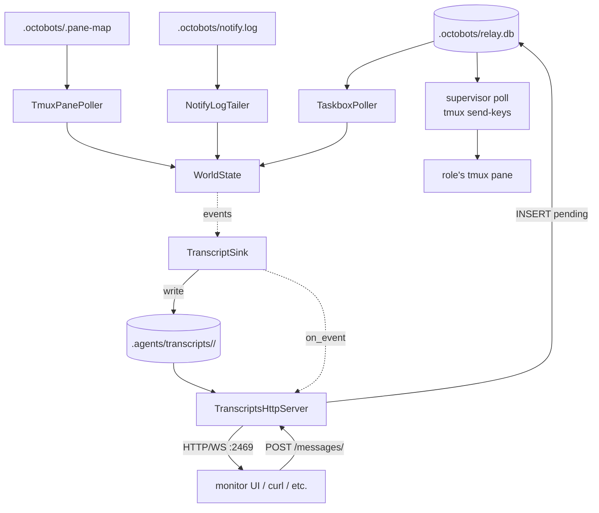

# Monitor Bridge

The bridge is the supervisor's monitor process. It tails three local sources
(`relay.db`, `tmux`, `notify.log`), mirrors per-task activity into the
project tree as plain JSON, and serves a small HTTP+WS endpoint that the
[monitor UI](https://github.com/arozumenko/octobots-ui) (and any other
consumer) reads from + posts inbound messages to.

## Running it

From the supervisor REPL:

```
> /monitor             # starts the data bridge + the Phaser UI dev server
> /monitor open        # opens http://127.0.0.1:5173/ in your browser
> /status              # see "data bridge: running" + "monitor ui: running"
> /monitor stop        # stops both
> /monitor restart     # cycles both
```

Demo without real workers:

```
> /sim start           # re-points the bridge at a sandbox + drives synthetic taskbox traffic
> /sim stop            # restores the bridge to the real project + stops the sim driver
```

Run it standalone (without the supervisor) — useful for tests:

```bash
cd supervisor
OCTOBOTS_PROJECT_ROOT=/path/to/your/project python3 -m monitor.bridge
```

## Per-role transcripts

For every taskbox message a role processes the bridge writes a per-task
file under `.agents/transcripts/<role>/`. Other tools (UIs, code-review
agents, future analyzers) read these as plain JSON.

```
.agents/transcripts/
└── <role>/
    ├── session.json                       ← index of this bridge run's tasks
    ├── current.json                       ← live: in-flight task
    └── 20260513T153022Z-<task_id>.json    ← archived completed tasks
                                              (kept: 20 newest per role, oldest pruned)
```

`session.json` is a fast-read index. Every role's `session.json` produced
in one bridge run shares the same `session_id` so a consumer can group
transcripts by supervisor session.

```json
{
  "session_id": "20260513T153000Z",
  "role": "qa",
  "started_at": 1731512300.0,
  "current_task_id": "m2",
  "tasks": [
    {"task_id": "m2", "sender": "pm", "status": "processing",
     "started_at": ..., "ended_at": null,
     "prompt_preview": "review PR #42", "response_preview": "",
     "notify_count": 0},
    {"task_id": "m1", "sender": "tech-lead", "status": "done",
     "started_at": ..., "ended_at": ...,
     "prompt_preview": "...", "response_preview": "...",
     "notify_count": 1}
  ]
}
```

Per-task file shape:

```json
{
  "task_id":   "abc123",        // relay.db message id
  "role":      "qa",
  "sender":    "pm",
  "prompt":    "verify PR #42…", // full task body
  "started_at": 1731512345.6,    // pending → processing
  "ended_at":   1731512412.8,    // processing → done
  "status":    "done",           // "processing" | "done" | "abandoned"
  "response":  "tests pass…",
  "activity": [
    {"ts": 1731512350.1, "kind": "notify", "channel": "telegram",
     "preview": "user, please review"}
  ]
}
```

`activity[]` collects events that fell within the task's `[started_at, ended_at]`
window. Today the only contributor is `mcp__notify__notify` calls (via the
`NotifyLogTailer`). The schema is additive — adding tool-use entries later
(kind: `bash`, `file_edit`, …) is forward-compatible with existing readers.

**Robustness:**

- Bridge starts mid-task (only saw the `done` transition, never the
  `claim`): the done event is silently dropped — no record is written.
  Supervisor's taskbox flow is unaffected.
- New claim for a role with one in flight: previous record is archived
  with `status: "abandoned"` so transcripts aren't silently lost.
- All writes are atomic (temp file + `os.replace`); a crash mid-write
  never leaves a half-formed `current.json` or archive.

## HTTP + WS endpoint

A small aiohttp listener fronts the transcript files. Loopback-only by
default, `Access-Control-Allow-Origin: *` so a same-machine browser can
fetch directly. Read-only **except for** `POST /messages/<role>`.

| Route | Returns |
|---|---|
| `GET /healthz` | `{"ok": true}` — liveness probe. |
| `GET /transcripts` | `{"roles": [{role, session_id, started_at, current_task_id, task_count}, ...]}` — one-line summary per role with a `session.json`. |
| `GET /transcripts/<role>` | Contents of that role's `session.json`. 404 if the role is unknown. |
| `GET /transcripts/<role>/<task_id>` | Full per-task record. Resolves to `current.json` if `task_id` is the in-flight task, otherwise to the matching archive file. 404 if not found. |
| `GET /events` | **WebSocket.** Emits a `snapshot` frame on connect with every role's `session.json`, then live frames as the sink observes activity. See below. |
| `POST /messages/<role>` | Insert a pending row into `relay.db` addressed to `<role>`. Supervisor's main-loop poll then dispatches via tmux `send-keys`. Body: `{"content": str, "sender"?: str}`. Returns `{"task_id": str, "recipient": str}` with status 201. Default sender: `user@transcripts`. |

WebSocket frames (`GET /events`):

```json
{"type": "snapshot",
 "roles": [{ /* contents of every role's session.json */ } ...]}

{"type": "task_claimed",
 "role":  "qa",
 "task":  { /* session.json entry for the new task */ }}

{"type": "task_done",
 "role":  "qa",
 "task":  { /* updated session.json entry */ }}

{"type": "task_notify",
 "role":   "qa",
 "task_id": "abc123",
 "notify_count": 2,
 "activity": {"ts": ..., "kind": "notify", "channel": "telegram",
              "preview": "ping the user"}}

{"type": "task_abandoned",
 "role":    "qa",
 "task_id": "abc123",
 "ended_at": 1731512412.8}
```

Client-to-server frames are ignored except for the protocol-level
heartbeat. To send a message *to* a role, use the `POST /messages/<role>`
endpoint — not the WS.

**Inbound message flow** (`POST /messages/<role>`):

```
UI → POST /messages/qa → insert pending row in relay.db
                      → supervisor's main-loop poll (~15s) picks it up
                      → tmux send-keys to qa's pane
                      → role's Claude Code receives the prompt
```

Bind failures (port in use, etc.) log a warning and disable the endpoint
without taking down the rest of the bridge.

## Env-var knobs

All optional; reasonable defaults.

| Variable | Default | Purpose |
|---|---|---|
| `OCTOBOTS_PROJECT_ROOT` | `cwd` | Project root the bridge watches. |
| `OCTOBOTS_RELAY_DB` | `<project>/.octobots/relay.db` | Taskbox SQLite file. |
| `OCTOBOTS_NOTIFY_LOG` | `<project>/.octobots/notify.log` | Notify JSONL log. |
| `OCTOBOTS_PANE_MAP` | `<project>/.octobots/.pane-map` | tmux pane map. |
| `OCTOBOTS_TASKBOX_INTERVAL` | `0.2` | Taskbox poll interval (s). |
| `OCTOBOTS_TMUX_INTERVAL` | `0.5` | Tmux capture interval (s). |
| `OCTOBOTS_NOTIFY_INTERVAL` | `0.5` | Notify log poll interval (s). |
| `OCTOBOTS_TRANSCRIPTS_ROOT` | `<project>/.agents/transcripts` | Where to write transcript files. |
| `OCTOBOTS_TRANSCRIPTS_RETENTION` | `20` | Number of completed tasks to keep per role; older files pruned on each finalize. |
| `OCTOBOTS_TRANSCRIPTS_HTTP_HOST` | `127.0.0.1` | Bind address for the HTTP endpoint. Keep loopback unless adding auth. |
| `OCTOBOTS_TRANSCRIPTS_HTTP_PORT` | `2469` | Port for the HTTP endpoint. |

## Architecture



## Module map

```
monitor/bridge/
├── __main__.py        # entry: wire sources to sink + http server
├── __init__.py
├── config.py          # paths, poll intervals, transcripts root, HTTP bind
├── events.py          # internal dataclasses (sources -> sink)
├── state.py           # WorldState (agents + recent messages)
├── relay_db.py        # shared helper: insert_taskbox_message
├── transcripts.py     # TranscriptSink — .agents/transcripts/<role>/*.json
├── transcripts_http.py # aiohttp HTTP+WS endpoint over the transcripts
└── sources/
    ├── taskbox.py     # tails relay.db, emits Message* events
    ├── tmux_panes.py  # captures pane content, emits AgentSpawn/State events
    └── notify_log.py  # tails notify.log, emits Notify events

scripts/
└── monitor-bridge.sh  # PYTHONPATH wrapper used by /monitor
```

## Tests

```bash
cd supervisor
python3 -m pytest tests/test_transcripts.py tests/test_transcripts_http.py -v
```

29 tests cover the transcript sink (lifecycle, notify-window matching,
abandonment, retention) and the HTTP+WS endpoint (route shapes, path
traversal, CORS, POST round-trip, WS snapshot + push frames).

## Not in v1

- **Tool-use activity entries** (`kind: bash`, `file_edit`, …). Needs
  Claude Code hooks (`PreToolUse` / `PostToolUse`) writing into the
  task's transcript file from inside each role's worker. The schema
  already supports it — just no source emits them yet.
- **WS frames for typing/idle state** beyond claim/done. The
  `TmuxPanePoller` already detects pane activity; piping that into a
  `task_typing` frame is a small addition when there's a consumer for it.
- **Authentication** on the HTTP endpoint. Loopback-only + read-mostly
  is the current safety model. If the endpoint ever moves off loopback,
  add bearer-token auth before exposing.
